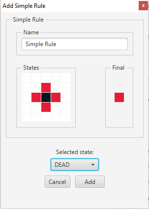

# Cellular Automaton

Java implementation of [Cellular Automaton](https://en.wikipedia.org/wiki/Cellular_automaton) with an editor which allows adding custom rules by using simple and complex rule editor.


## Demo
The demo shows loading CrawlingAnimal template and its rules.
One additional simple rule is added and the grid is changed to show that the simple rule is working.


## Documentation

### States
A cell can be in one of 3 states (Dead, Alive and Empty). Ignored state is used while creating rules to ignore the state of specific neighbor cells.


### Simple Rule
Allows creating a rule in a 5x5 grid to represent the current state and the final state.

#### Notice the difference between very similar two rules.
The first rule means: If I am alive and there are 4 dead cells around me and the rest are empty, then I will die.
The second rule means: If I am alive and there are 4 dead cells around me and the rest can be in any state, then I will die.

  

### Schema Rule
Allows creating complex rules by combining simple, complex and custom schemas.

 

### Templates
There are 4 templates to test how things are working. After choosing a template, rules can be edited or the state of any cell in the grid can be changed.


## Optimizations

The main optimization is done by storing rules as a pattern in bits of two Long values. Thanks to this pattern matching is done by bitwise operators instead of cell by cell comparison.

### Pattern
Stores 3 states (Dead, Alive and Empty) from each 25 (5x5 matrix) cells (total 75 states) in two Long values. Because one Long value can store only 64 states.

```java
public class Pattern {
    private long firstWord;
    private long secondWord;
    ...

    public void setFirstWord(int stateValue, int index) {
        index *= 3;
        stateHolder = stateValue;
        firstWord = firstWord | (stateHolder << index);
    }
        
    public void setSecondWord(int stateValue, int index) {
        index *= 3;
        stateHolder = stateValue;
        secondWord = secondWord | (stateHolder << index);
    }

    /** 5x5 grid is calculated into a pattern. */
	public void calculate(State[] states) {
		reset();
		
		for(int i = 0; i < 21; ++i) {
			setFirstWord(states[i].getValue(), i);
		}
		
		for(int i = 0; i < 4; ++i) {
			setSecondWord(states[i + 21].getValue(), i);
		}
	}

    /** Checks if given pattern is contained in this pattern. */
    public boolean contains(Pattern pattern) {
        if((this.firstWord & pattern.firstWord) == pattern.firstWord &&
            (this.secondWord & pattern.secondWord) == pattern.secondWord) {
            return true;
        }
        return false;
    }
}
```

### Cell
Represents a cell in the grid. Each step of a cell's pattern is calculated based on neighbor cell states.
After the pattern of all cells are calculated, rules can be applied (by just testing the cell's pattern with rule's pattern) to change the state of cells.

```java
public class Cell {
    private Pattern pattern;
    ...

    public void calculatePatternValue() {
		pattern.reset();
		for(int i = 0; i < 21; ++i) {
			Cell cell = neighbors[i];
			if(cell != null) {
				pattern.setFirstWord(cell.getState().getValue(), i);
			} else {
				pattern.setFirstWord(State.EMPTY.getValue(), i);
			}
		}
		
		for(int i = 0; i < 4; ++i) {
			Cell cell = neighbors[i + 21];
			if(cell != null) {
				pattern.setSecondWord(cell.getState().getValue(), i);
			} else {
				pattern.setSecondWord(State.EMPTY.getValue(), i);
			}
		}
	}
}
```

### Simple Rule
A simple rule is stored as a pattern, then the pattern is tested against a given cell's pattern if the cell's pattern contains the rule's pattern.
```java
public class SimpleRule {
    private Pattern pattern;
    ...

    public boolean matches(Pattern pattern) {
		return pattern.contains(this.pattern);
	}
}
```

## License

[MIT](https://choosealicense.com/licenses/mit/)